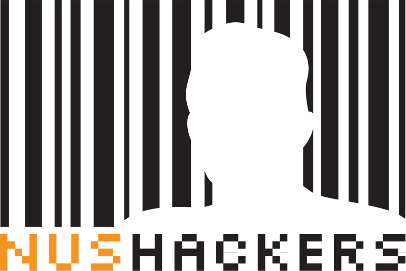
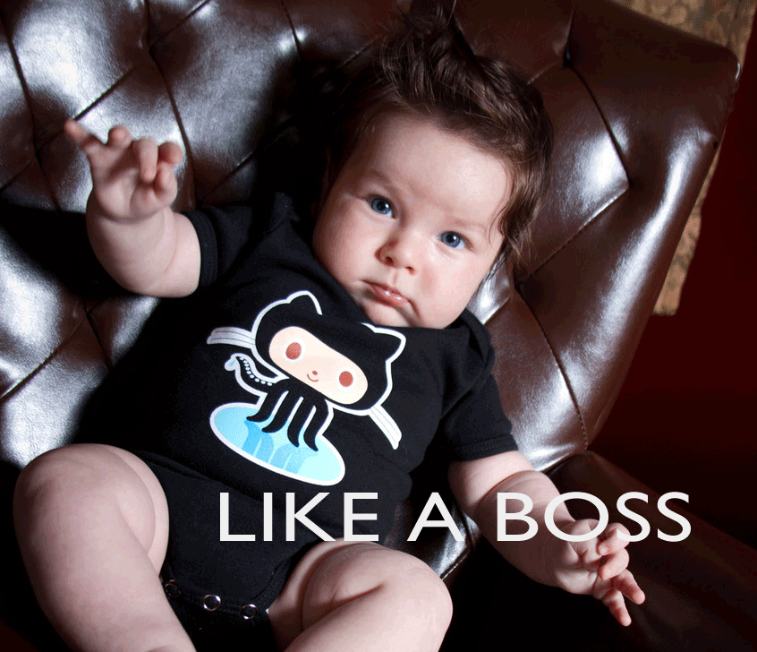

!SLIDE center transition=scrollLeft

!SLIDE
## NUS Hackers ##
# Welcome Tea #

!SLIDE bullets incremental transition=scrollLeft
# Agenda #

* I speak
* Alumni speak
* Call for registrations
* Pizza! :D

!SLIDE center transition=scrollLeft

!SLIDE center transition=scrollLeft

## Who We Are ##

!SLIDE bullets incremental transition=scrollLeft
# Hacker? #

* not ‘unauthorized breaking-in of a computer system’
* 1960s programmer subculture (MIT AI Lab)

!SLIDE transition=scrollLeft
# What Is Hacking? #
## Playful Cleverness ##

!SLIDE bullets transition=scrollLeft
# nushackers.org/name-change/ #

* But why 'hackers'?

!SLIDE bullets incremental transition=scrollLeft
# Why Hackers #

* linuxNUS no longer describes us
* Hacking == most accurate adjective
* Signals, and opportunities.

!SLIDE bullets incremental transition=scrollLeft
# What We Do #

* Support System
* Build Community
* Pass _and_ Create Opportunities

!SLIDE transition=scrollLeft
# "If you create a community, everyone benefits" #

!SLIDE bullets incremental transition=scrollLeft
# Events #

* Friday Hacks (every Friday, 7-10pm, UTown)
* Python Workshop Series (TBA)
* 2-4 Workshops on General Topics (TBA)
* Software Freedom Day (17 September)
* Geekcamp (1st October)

!SLIDE transition=scrollLeft
# nushackers.org/events #
## Up to date! ##

!SLIDE bullets incremental transition=scrollLeft
# Membership #
* Join the mailing list
* Perks: priority registration, cheaper fee
* Weekly meeting - Friday Hacks
* Coreteam membership (¿)
* RHAPS system - TBC; dialogue (¿)

!SLIDE center transition=scrollLeft
# Questions? #

